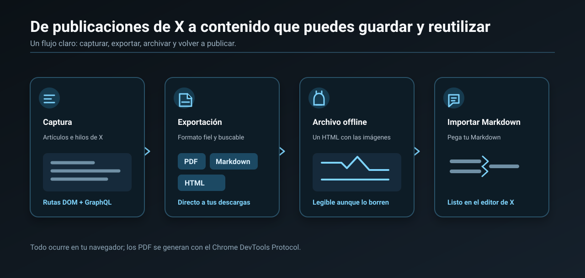
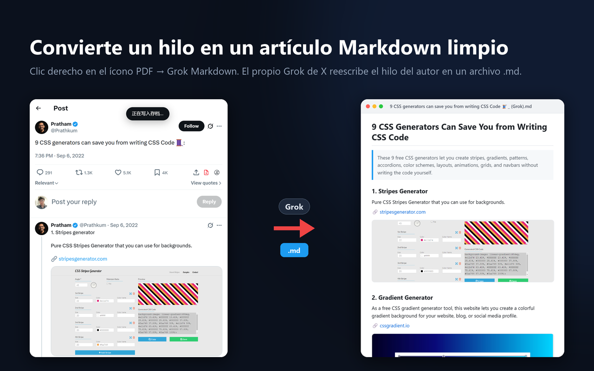

<p align="center">
  <a href="README.md">English</a> ·
  <a href="README.zh-CN.md">简体中文</a> ·
  <b>Español</b> ·
  <a href="README.pt-BR.md">Português (Brasil)</a>
</p>

<p align="center">
  <a href="https://chromewebstore.google.com/detail/akmedeebhjkchcpocceffimhpmfjimhn">
    
  </a>
</p>

<p align="center">
  <a href="https://chromewebstore.google.com/detail/akmedeebhjkchcpocceffimhpmfjimhn"></a>
</p>

<p align="center">
  <b><a href="https://chromewebstore.google.com/detail/akmedeebhjkchcpocceffimhpmfjimhn">Instalar desde Chrome Web Store</a></b><br>
  Gratis · sin clonar, sin compilar, sin modo de desarrollador · se actualiza solo · también funciona en Edge
</p>

<p align="center">
  
  
  
</p>

# X Article to PDF — Exporta Artículos e hilos de Twitter a PDF y Markdown

**X Article to PDF** es una extensión de Chrome gratuita y de código abierto que guarda los
**Artículos** y los **hilos** de X (Twitter) como PDF de verdad —texto seleccionable y buscable,
imágenes en resolución original— o como Markdown y HTML autónomo, en un clic y directo a tus descargas.
Sin cuadro de diálogo de impresión, sin pestañas nuevas y sin crear cuentas.

También convierte un hilo largo que el autor siguió en sus propias respuestas (consejo 1, consejo 2,
consejo 3…) en un solo artículo Markdown limpio usando el propio Grok de X, y pega Markdown en el editor
de Artículos de X con el formato intacto.

## Funciones



## Uso

### Extensión de Chrome (recomendado)

1. Instálala desde **[Chrome Web Store](https://chromewebstore.google.com/detail/akmedeebhjkchcpocceffimhpmfjimhn)** (Edge también puede instalarla desde ahí)
2. Abre cualquier Artículo de X, o una publicación que el autor continuó como hilo
3. Haz clic en el ícono rojo de **PDF** de la barra de acciones de la publicación, junto a guardar y compartir


- **Clic izquierdo** = exportar PDF (se genera en segundo plano y aparece en tus descargas)
- **Clic derecho** = menú de formatos: PDF / Markdown / HTML (autónomo, imágenes incluidas, se abre sin conexión) / Grok Markdown / Archivo
- El ícono de la extensión en la barra del navegador hace lo mismo que el clic izquierdo

> **Hilos:** después de instalar, **recarga la página una vez** antes de exportar. El interceptor de
> red solo captura las solicitudes que se hacen después de instalarse, y la solicitud `TweetDetail` de
> la página actual ya se envió. Si no se capturó nada, la extensión extrae el contenido del DOM y te
> lo avisa.

### Grok Markdown: convierte un hilo en un artículo

Muchos autores publican un texto largo como una cadena de respuestas a sí mismos: consejo 1, consejo 2,
consejo 3… Abre esa publicación, haz clic derecho en el ícono rojo de PDF y elige **Grok Markdown (AI
rewrite)**. La extensión le pasa el hilo completo a Grok en x.com (con tu propia cuenta, en una pestaña
en segundo plano) y Grok lo reescribe como un solo artículo Markdown limpio: título, resumen de una
línea, un encabezado por punto, y enlaces e imágenes conservados. El archivo `.md` llega a tus
descargas, normalmente en menos de un minuto.



- La opción solo aparece en la página de la publicación y solo si el autor la continuó en sus propias respuestas
- Usa el modo **Experto** de Grok si tu cuenta lo tiene; si no, el modo disponible
- Solo el texto del hilo va al propio Grok de X; la conversación queda en tu historial de Grok
- La opción **Markdown** normal del mismo menú es la exportación sin IA

### Markdown → editor de Artículos de X

Abre `x.com/compose/articles/edit/<id>` y verás un ícono nuevo **a la izquierda de Preview**. Pega tu
Markdown tal cual en el cuerpo del artículo y haz clic en el ícono: el texto se convierte, en el mismo
lugar, al formato propio de los Artículos de X (títulos / listas / citas / bloques de código / negrita
y cursiva / enlaces). No hay ventana de confirmación; si algo sale mal, presiona **Ctrl+Z**, que usa el
historial de edición del propio editor.


Lo que un Artículo de X no puede mostrar se simplifica, para no perder texto: las tablas pasan a ser
párrafos simples como `A | 1`, las líneas divisorias a una línea `— — —` y las imágenes a enlaces (X
exige subir las imágenes con su propio cargador).

**X no admite bloques de código**: probado en el editor real, tanto los bloques ```` ``` ```` como el
código en línea `` ` `` quedan como texto normal (el texto se conserva, solo se pierde el estilo).
Funcionan bien: tres niveles de título, listas ordenadas y con viñetas (también anidadas), citas,
negrita, cursiva y enlaces.

### Userscript / bookmarklet

Arrastra `x-article-exporter.user.js` a Tampermonkey, o pega todo el contenido de `bookmarklet.txt` en
la URL de un marcador.

Estas dos formas **no tienen el backend de la extensión**, así que el PDF no está disponible: después de
2.5 s se descarga en su lugar un HTML autónomo. El bookmarklet además se inyecta demasiado tarde para
interceptar la red, así que en los hilos solo puede extraer el contenido del DOM.

## Preguntas frecuentes

### ¿Cómo guardo un Artículo de X (Twitter) como PDF?

Instala la extensión, abre el Artículo en x.com y haz clic en el ícono rojo de PDF de la barra de
acciones. El PDF se genera en segundo plano y se guarda en tus descargas, sin cuadro de impresión. El
texto sigue siendo seleccionable y buscable, y las imágenes conservan su resolución original.

### ¿Cómo guardo un hilo de Twitter como PDF?

Abre la primera publicación del hilo (su propia página, `x.com/<usuario>/status/<id>`), recarga la página
una vez después de instalar la extensión y haz clic en el ícono de PDF. La extensión reconstruye el hilo
completo con los datos de X, así que no se pierden las publicaciones que ya salieron de la pantalla.

### ¿Cómo convierto un hilo de Twitter a Markdown para Obsidian o Notion?

Haz clic derecho en el ícono de PDF y elige **Markdown** para una exportación directa, o **Grok Markdown**
para que Grok reescriba el hilo como un artículo con título, resumen y encabezados. Las dos opciones
guardan un archivo `.md` que puedes llevar a Obsidian, Notion, Logseq o cualquier editor Markdown.

### ¿Es gratis? ¿Recopila mis datos?

Es gratis y de código abierto (MIT). No recopila nada: sin cuenta, sin servidor, sin analíticas, sin
código remoto. La única función que envía contenido es Grok Markdown, que manda el texto del hilo al
propio Grok de X con tu propia cuenta. Más detalles en [PRIVACY.md](PRIVACY.md).

### ¿Por qué Chrome muestra "comenzó a depurar este navegador"?

Así la extensión genera un PDF real sin cuadro de impresión: usa la API `debugger` de Chrome para
renderizar la página a PDF en una pestaña en segundo plano. Chrome siempre muestra ese aviso mientras
tanto y desaparece al terminar. Si el depurador no se puede conectar, recibes un HTML autónomo.

### ¿Funciona en Microsoft Edge?

Sí. Edge puede instalar extensiones directamente desde Chrome Web Store.

## Para desarrolladores

La arquitectura, las trampas que explican el diseño y cómo cargar la extensión desde el código fuente
están en [docs/DEVELOPMENT.md](docs/DEVELOPMENT.md) (en inglés, para que no queden versiones
desactualizadas).

## Privacidad

**No recopila ningún dato.** Sin cuenta, sin servidor, sin analíticas, sin código remoto. Todas las
exportaciones y archivos se generan localmente en tu navegador. Para qué sirve cada permiso (`debugger`
/ `downloads` / `storage`) se explica en [PRIVACY.md](PRIVACY.md).

## Proyectos relacionados

La idea de "simular un pegado para usar el propio cargador del editor" se separó después en dos
extensiones independientes y sin permisos:

- [csdn-md-importer](https://github.com/wangsen2020/csdn-md-importer) — Markdown al editor de CSDN en un clic, con subida automática de imágenes
- [zhihu-md-importer](https://github.com/wangsen2020/zhihu-md-importer) — Markdown a las columnas de Zhihu en un clic, con subida automática de imágenes

Este repositorio se enfoca en hacer bien una sola cosa en X: exportar Artículos e hilos, e importar
Markdown al editor de Artículos de X.

## Licencia

MIT
