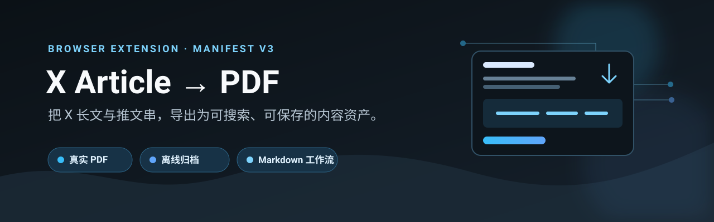
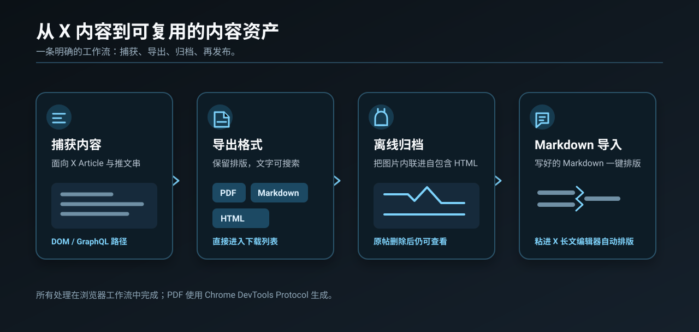

<p align="center">
  
  
  
</p>

# X Article → PDF

把 X (Twitter) 的 **Article 长文**或**推文串**导出为保留排版的 PDF——
文字可选中可搜索、图片原图分辨率、直接进浏览器下载列表，不弹打印对话框、不开新标签页。

也可以导出为图片全部内联的自包含 HTML，用于离线归档。

## 功能 / Features



## 用法

### Chrome 扩展（推荐）

1. `chrome://extensions` → 打开「开发者模式」→「加载已解压的扩展程序」→ 选中本文件夹
2. 打开任意 X 长文 / 推文串页面
3. 点帖子操作栏里的 **PDF** 按钮（在书签、分享图标旁边）——**只有 X 长文（Article）才有这个图标**


- **左键** = 导出 PDF（静默生成，落到下载列表）
- **右键** = 导出自包含 HTML（图片内联为 data URI，可离线打开）
- 也可以点浏览器工具栏上的扩展图标，效果同左键

按钮是纯图标、红色、无圆形背景，跟随 X 原生规格（viewBox 24×24、18.75px、`fill` 而非 `stroke`）。
对齐要点：操作栏是 `align-items:stretch`，兄弟节点高 47px，**给按钮固定高度会变成顶端对齐**，
图标中心比原生图标高约 7px；必须用 `align-self:stretch` 跟着撑满。
文案在 hover 提示和 `aria-label` 里，全部走 `extract.js` 顶部的 `I18N` 表。
加一种语言只需往 `I18N` 里加一个键，不用碰任何 DOM 结构。目前内置 `zh` / `en`，
按 `navigator.language` 自动选。

> **推文串**场景：装完扩展后**刷新一次页面**再导出。网络拦截器只能捕获它装好之后
> 发出的请求，当前页面的 `TweetDetail` 早就发完了。捕获不到会自动降级抓 DOM 并提示。

### Markdown → 长文编辑器（写的方向）

进 `x.com/compose/articles/edit/<id>`，**Preview 按钮左边**多一个图标。把 Markdown 原样
贴进正文框，点一下图标：正文就地变成 X 长文自己的排版（标题 / 列表 / 引用 / 代码块 /
粗斜体 / 链接）。没有确认弹窗，转错了按 **Ctrl+Z** —— 走的是 Draft 自己的编辑历史。


实现的关键是**不要碰 DOM**。X 的长文编辑器是 Draft.js，真身是内存里的 ContentState，
contenteditable 只是投影——塞 innerHTML 不但不认，下一次 setState 还会把它抹掉。
Draft 唯一对外开放的富文本入口是 `paste`：它的 `editOnPaste` 读 `clipboardData` 里的
`text/html`，用自己的转换器解析。所以做法是 Markdown → 一份 Draft 认得的 HTML →
合成一次 `ClipboardEvent('paste')`。

三个实测结论（Draft 0.11.7，见 `compose.js` 注释）：

- **要接的是组件实例，不是 props**。React 双缓冲两棵 fiber 树，DOM 节点上挂的
  `__reactFiber$` 常常指着旧的那棵，`memoizedProps.editorState` 会慢一拍——实测读出来是
  「空文档」，而同一时刻实例上的 `_latestEditorState` 是最新的。读状态用它，写回用
  实例的 `update()`，那正是 Draft 内部改状态走的同一个口子。
- **嵌套列表只认「子列表是父列表的兄弟」**：`<ul><li>B</li><ul><li>B1</li></ul></ul>` 给出
  `depth:1`；写成 `<li>B<ul>…</ul></li>` 会塌成一块 `BB1`（而后者恰好是大多数 Markdown
  库的默认输出）。
- **DOM 选区对 Draft 无效**：`Range` 和 `execCommand('selectAll')` 都改不动它（后者还返回
  true），粘贴照样插在它自己记着的光标处。要整篇替换只能 `forceSelection` 撑开它的选区。

转完一次之后正文里已经没有任何标记了，这时再点会把整篇当大白文重排成清一色段落——
所以没有 Markdown 标记就直接不动，顺带挡住误点。

图标插在 Preview 左边。**Preview 不是 `<button>`，也没有 `role="button"`，它是
`<a role="link">`**——第一版只在 button / role=button 里找，真实编辑页 0 命中，图标退回了
右下角悬浮。所以现在不认标签只认文字：找到「整个元素就只有 Preview 这几个字」的叶子
节点，往上爬到文本仍然只有这几个字的最外层，插在它前面。

X 长文放不下的东西一律降级，宁可朴素也不丢字：表格 → `甲 | 1` 的普通段落，
分隔线 → 一行 `— — —`，图片 → 链接（X 的图必须走它自己的上传）。

**代码块 X 不支持**：真机实测 ```` ``` ```` 围栏和行内 `` ` `` 都会落成普通段落 / 普通文字
（文字不丢，只丢样式）。它的工具栏里也确实没有代码按钮。真机通过的是：三级标题、
有序 / 无序列表（含嵌套 depth）、引用、粗体、斜体、链接。

### 油猴脚本 / 书签小工具

`x-article-exporter.user.js` 拖进 Tampermonkey；或把 `bookmarklet.txt` 全部内容粘进书签网址栏。

这两种形态**没有扩展后台**，拿不到 `chrome.debugger`，所以 PDF 请求会在 2.5s 后超时并
自动改为下载自包含 HTML。书签小工具还因为注入太晚装不上网络拦截器，推文串只能走 DOM 降级。

## 三条硬约束（都是实测踩出来的，改代码前先读）

### 1. 预滚动必须停在文章底部，绝不能滚到 document 底

X Article 的正文只在**文章自身的滚动范围内**不虚拟化。一旦滚进评论区，
整篇正文会被从 DOM 卸载：

| 指标 | 滚到 document 底 | 滚到文章底 |
|---|---|---|
| 正文块数 | **0**（正文被卸载，根 article 元素也被换掉） | **136** |
| 正文配图 | 0，且混入评论区的图 | **11** |
| 滚动终点 | 27354 | **17529** |

所以 `loadArticle()` 每轮重算 `articleRoot().getBoundingClientRect().bottom + scrollY`
作为上限，并留半屏余量。另外正文渲染出来之前这个高度是 0，会把上限算成负数——
必须先等 `.longform-unstyled` 出现再开始。

### 2. 所有选择器必须限定在正文根 article 内

全文档选择会把评论区的配图当成正文插图抽进来，配合约束 1 的正文卸载问题会抽出一锅混合物。

### 2b. 封面图去重不能用字符串 includes

`parts` 里的 URL 已经过 `esc()`（`&` → `&amp;`），拿未转义的原始 URL 去 `includes` 比对
**永远匹配不上**，封面会被重复插入一次。实测某篇文章封面 URL 含 `&`，
旧逻辑 100% 复现重复。现在改用抽取过程中收集的原始 URL `Set` 判重。

### 3. 不要在页面里调 print()

新开的同源标签页和 x.com **共用渲染进程**，大文档的打印预览会把原页面主线程一起冻住
（表现为页面完全卡死、滚轮无响应）。所以现在：

- PDF 渲染放在**扩展页面**（`chrome-extension://` 源，独立进程）里做
- 传给它的文档保持「远程图片链接」的轻量形态（几十 KB），只有导出 HTML 时才内联图片

## 两条抽取路径

### Article 长文 —— 抓 DOM

用 `.longform-unstyled` / `.longform-header-one` / `.longform-header-two` /
`.longform-blockquote` / `.longform-ordered-list-item` / `[data-testid="tweetPhoto"]`
作锚点，还原成 `<p> <h2> <h3> <blockquote> <ol> <figure>`。

加粗必须走 computed style：**X 不用 `<strong>`，加粗是 CSS class 做的**；
而且 `font-weight` 会继承，要和父元素比较，否则会抽出嵌套重复的 `<strong>`。

### 推文串 —— 拦 GraphQL

推文串在 DOM 里是虚拟列表，抓 DOM 必然丢内容。`net-hook.js` 在 `document_start`
抢在 X 自己的请求之前装好 fetch / XHR 拦截，缓存 `TweetDetail` 响应，
导出时直接从结构化 JSON 重建。这条路径还能拿到 DOM 里已经损失的信息：

| 字段 | 拿到了什么 |
|---|---|
| `note_tweet.richtext.richtext_tags` | 长推文加粗 / 斜体的精确区间 |
| `note_tweet.media.inline_media` | 正文中间内嵌图片及其插入位置 |
| `entities.urls[].expanded_url` | 链接真实地址（DOM 里只有 t.co 短链） |
| `extended_entities.media` | 原始媒体，不受显示尺寸影响 |

**所有下标都是码点（code point），不是 UTF-16 code unit。**
中文和 emoji 下按 `string.length` 切会整体错位，必须先 `Array.from()`。
`node test-renderRich.js` 有 11 条单元测试覆盖这块。

## PDF 是怎么生成的

`chrome.debugger` + `Page.printToPDF`。这是扩展里**唯一**能拿到
「真 PDF、矢量文字、无打印对话框、不开可见标签页」的途径。

代价：Chrome 会显示一条 **「"X Article → PDF" 已开始调试此浏览器」** 的横幅。
这是 Chrome 的强制提示，无法去掉。横幅出现期间 DevTools 不能用（反之亦然）。

流程：内容脚本把轻量 HTML 交给后台 → 后台在**后台标签页**里打开扩展页面渲染 →
等图片解码完 → `printToPDF` → 页面用 `<a download>` 触发下载 → 关掉标签页。
全程不切走你当前的页面。

如果 debugger 附加失败（DevTools 已打开、企业策略限制等），**不会弹打印对话框**——
直接改为下载自包含 HTML 并提示原因。整条链路里任何一步都不会打断你手上的操作。

## 其他已知坑

- **必须保持页面在前台**。后台标签页 Chrome 不加载懒加载图片（实测滚了 23 轮图片数
  一直是 0，一强制重绘立刻变 14 张），脚本会先等你切回来。
- **fetch 图片前要把 `&amp;` 还原成 `&`**。HTML 转义过的 URL 直接拿去 fetch，
  X 图床会返回空响应且**不报错**，内联出来是一堆空图。
- **注入必须落在 MAIN world**。缓存的 GraphQL 数据挂在页面的 `window` 上，
  隔离世界读不到；图片 fetch 也需要页面自己的 x.com 源才有 CORS。
  MAIN world 没有 `chrome.*` API，所以用 `bridge.js`（隔离世界）做 postMessage 中转。
- X 随时可能改版。Article 路径会变的是 `ART_SEL` 那几个 class；
  推文串路径会变的是 GraphQL 字段结构（`collectFromGQL` / `userOf` 已兼容新旧 schema）。

## 尚未验证

以下部分只有代码和推理，**没有跑通过端到端**：

- `chrome.debugger` + `printToPDF` 整条链路（需要装上扩展实跑）
- PDF 的实际分页表现（标题是否孤立在页尾、大图是否被切断）
- 推文串 GraphQL 路径的端到端（渲染函数有单元测试，但没在真实长串上跑过）

已在真实页面验证过的：正文抽取与边界（136 块 / 11 图）、加粗抽取、图片内联
（11/11，0 失败）、渲染效果、操作栏按钮挂载。

## 隐私

**不收集任何数据。** 没有账号、没有服务器、没有统计、没有远程代码。所有导出和归档都在
你自己的浏览器本地完成。`debugger` / `downloads` / `storage` 这几个权限分别用来做什么，
详见 [PRIVACY.md](PRIVACY.md)。

## 文件

| 文件 | 用途 |
|---|---|
| `extract.js` | 抽取、渲染、按钮挂载；定义 `window.__XAE_RUN(mode)`（MAIN world） |
| `compose.js` | Markdown → Draft.js 粘贴注入，长文编辑页的图标（MAIN world） |
| `md2html.js` | Markdown → Draft 认得的 HTML，compose.js 用 |
| `net-hook.js` | GraphQL 网络拦截（MAIN world，`document_start`） |
| `bridge.js` | 隔离世界中继，MAIN ↔ 后台（MAIN 没有 `chrome.*`） |
| `background.js` | `chrome.debugger` + `printToPDF` |
| `viewer.html` / `viewer.js` | 扩展页面，独立进程里渲染文档并触发下载 |
| `extract.min.js` / `bookmarklet.txt` | 书签小工具 |
| `x-article-exporter.user.js` | 油猴脚本 |
| `test-renderRich.js` | 富文本渲染单元测试，`node test-renderRich.js` |

## 相关项目

「合成 paste 借编辑器自己的上传流水线」这套思路后来拆成了两个独立的零权限扩展：

- [csdn-md-importer](https://github.com/wangsen2020/csdn-md-importer) —— Markdown 一键灌进 CSDN 编辑器，图片自动上传
- [zhihu-md-importer](https://github.com/wangsen2020/zhihu-md-importer) —— Markdown 一键灌进知乎专栏，图片自动上传

本仓库专注做好 X 一件事：Article 长文 / 推文串导出，以及 Markdown 导入 X 长文编辑器。

## License

MIT
