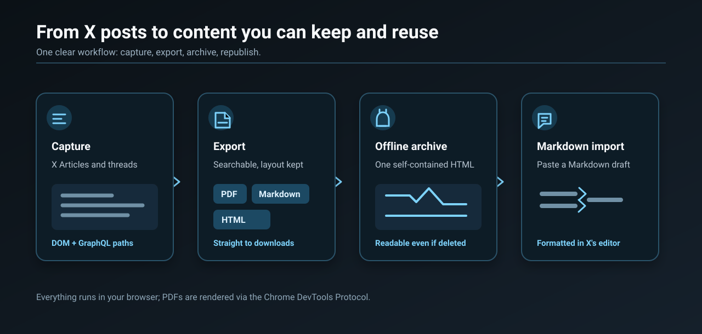
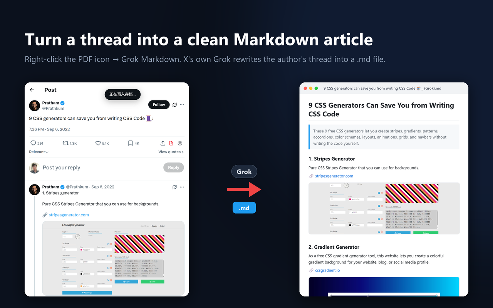

  <b>English</b> ·
  <a href="README.zh-CN.md">简体中文</a> ·
  <a href="README.es.md">Español</a> ·
  <a href="README.pt-BR.md">Português (Brasil)</a>

  

  

  <b><a href="https://chromewebstore.google.com/detail/akmedeebhjkchcpocceffimhpmfjimhn">Install from the Chrome Web Store</a></b> 
  Free · no clone, no build, no developer mode · auto-updates · works in Edge too

  
  
  

# X Article to PDF — Export Twitter Articles & Threads to PDF and Markdown

**X Article to PDF** is a free, open-source Chrome extension that saves X (Twitter) **Articles** and
**threads** as real PDFs — selectable, searchable text and full-resolution images — or as Markdown and
self-contained HTML, in one click, straight to your downloads. No print dialog, no new tab, no account.

It can also turn a long self-thread (tip 1, tip 2, tip 3… posted as replies) into one clean Markdown
article using X's own Grok, and paste Markdown into X's Article editor with the formatting intact.

## Features

- **X Article / Twitter thread → PDF**: vector text you can search and copy, images at original resolution
- **Twitter thread → Markdown**: plain Markdown export, or an AI rewrite into an article with **Grok Markdown**
- **Self-contained HTML**: every image inlined, opens offline even if the original post is deleted
- **Local archive**: optional on-device library of everything you exported
- **Markdown → X Article editor**: paste a Markdown draft and convert it to X's native formatting
- **Private**: no server, no analytics; everything runs in your browser

## How to use

1. Install it from the **[Chrome Web Store](https://chromewebstore.google.com/detail/akmedeebhjkchcpocceffimhpmfjimhn)** (Edge can install it from there too)
2. Open any X Article, or a post the author continued as a thread
3. Click the red **PDF** icon in the post's action bar, next to bookmark and share

- **Left-click** = export PDF (generated in the background, lands in your downloads)
- **Right-click** = format menu: PDF / Markdown / HTML (self-contained, opens offline) / Grok Markdown / Archive
- Clicking the extension's toolbar icon does the same as a left-click

> **Threads:** after installing, **reload the page once** before exporting. The extension reads the
> thread from X's own network responses, and the current page's responses arrived before it was
> installed. If nothing was captured it falls back to reading the page and tells you so.

### Turn a Twitter thread into a Markdown article with Grok

Plenty of authors publish a long piece as a chain of replies to themselves: tip 1, tip 2, tip 3…
Open that post, right-click the red PDF icon and pick **Grok Markdown (AI rewrite)**. The extension
hands the whole self-thread to Grok on x.com (your own logged-in account, in a background tab), and
Grok rewrites it into one clean Markdown article: a title, a one-line summary, one heading per point,
links and images kept. The `.md` file lands in your downloads, usually in under a minute — ready for
Obsidian, Notion or any Markdown editor.

- The item only appears on a post's own page, and only when the author continued the post in their own replies
- Uses Grok's **Expert** mode when your account has it, otherwise whatever mode is available
- Only the thread's text is sent, and only to X's own Grok; the conversation shows up in your Grok history
- The plain **Markdown** item in the same menu is the no-AI export

### Paste Markdown into the X Article editor

Open `x.com/compose/articles/edit/<id>` and you'll see an extra icon **to the left of Preview**. Paste
your Markdown into the body as-is and click the icon: the body turns into X's own Article formatting
in place (headings / lists / quotes / bold and italic / links). There's no confirmation dialog — if it
goes wrong, press **Ctrl+Z**; it uses the editor's own edit history.

Whatever an X Article can't hold is downgraded rather than lost: tables → plain paragraphs like
`A | 1`, horizontal rules → a `— — —` line, images → links (X images must go through its own upload).
X Articles have no code formatting, so code blocks and inline code land as plain text.

### Userscript / bookmarklet

Drag `x-article-exporter.user.js` into Tampermonkey, or paste the whole of `bookmarklet.txt` into a
bookmark's URL field. Neither has the extension's background page, so they export self-contained HTML
instead of PDF, and the bookmarklet can only read threads from the page itself.

## FAQ

### How do I save an X (Twitter) Article as a PDF?

Install the extension, open the Article on x.com and click the red PDF icon in the post's action bar.
The PDF is generated in the background and saved to your downloads — no print dialog. The text stays
selectable and searchable, and images keep their original resolution.

### How do I save a Twitter thread as a PDF?

Open the first post of the thread (its own page, `x.com/<user>/status/<id>`), reload the page once
after installing, then click the PDF icon. The extension rebuilds the whole thread from X's own data,
so posts that the timeline has scrolled out of view are not lost.

### How do I convert a Twitter thread to Markdown for Obsidian or Notion?

Right-click the PDF icon and pick **Markdown** for a direct export, or **Grok Markdown** to have Grok
rewrite the thread into a structured article with a title, summary and headings. Both save a `.md` file
you can drop into Obsidian, Notion, Logseq or any Markdown editor.

### Is it free? Does it collect my data?

It's free and open source (MIT). It collects nothing: no account, no server, no analytics, no remote
code. The only feature that sends content anywhere is Grok Markdown, which sends the thread's text to
X's own Grok in your own account. Details in [PRIVACY.md](PRIVACY.md).

### How is this different from Thread Reader App?

Thread Reader App is a web service: you reply to a thread with a bot mention and read the unrolled
version on its site. This extension works in your own browser, right on x.com: one click saves the
Article or thread as a PDF, Markdown or HTML file on your computer, and it also handles X Articles.

### Why does Chrome show "started debugging this browser"?

That's how the extension produces a real PDF without a print dialog: it uses Chrome's `debugger` API to
render the page to PDF in a background tab. Chrome always shows this banner while it runs; it closes
when the export finishes. If the debugger can't attach, you get a self-contained HTML file instead.

### Does it work in Microsoft Edge?

Yes. Edge can install extensions from the Chrome Web Store directly.

## Privacy

**No data is collected.** No account, no server, no analytics, no remote code. Every export and archive
happens locally in your own browser. What each permission is used for is explained in
[PRIVACY.md](PRIVACY.md).

## For developers

Architecture, the traps behind the design, and how to load the extension from source are in
[docs/DEVELOPMENT.md](docs/DEVELOPMENT.md). Unit tests: `node test-renderRich.js`.

## Related projects

The "synthesize a paste and ride the editor's own upload pipeline" idea was later split out into two
standalone, zero-permission extensions:

- [csdn-md-importer](https://github.com/wangsen2020/csdn-md-importer) — one-click Markdown into the CSDN editor, images uploaded automatically
- [zhihu-md-importer](https://github.com/wangsen2020/zhihu-md-importer) — one-click Markdown into Zhihu columns, images uploaded automatically

## License

MIT
