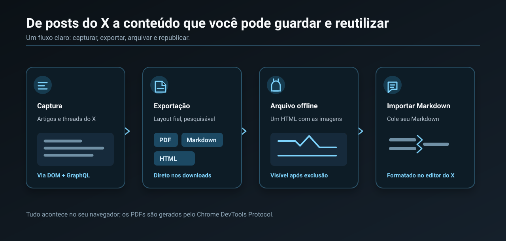
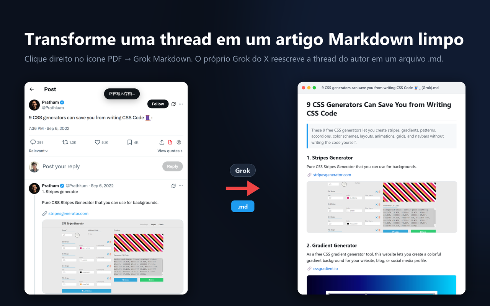

<p align="center">
  <a href="README.md">English</a> ·
  <a href="README.zh-CN.md">简体中文</a> ·
  <a href="README.es.md">Español</a> ·
  <b>Português (Brasil)</b>
</p>

<p align="center">
  <a href="https://chromewebstore.google.com/detail/akmedeebhjkchcpocceffimhpmfjimhn">
    
  </a>
</p>

<p align="center">
  <a href="https://chromewebstore.google.com/detail/akmedeebhjkchcpocceffimhpmfjimhn"></a>
</p>

<p align="center">
  <b><a href="https://chromewebstore.google.com/detail/akmedeebhjkchcpocceffimhpmfjimhn">Instalar pela Chrome Web Store</a></b><br>
  Grátis · sem clonar, sem build, sem modo de desenvolvedor · atualiza sozinha · funciona no Edge também<br>
  🌐 <a href="https://xexport.goodexts.com/pt-br">Site, guias e perguntas frequentes: xexport.goodexts.com</a>
</p>

<p align="center">
  
  
  
</p>

# X Article to PDF — Exporte Artigos e threads do Twitter para PDF e Markdown

**X Article to PDF** é uma extensão gratuita e de código aberto para o Chrome que salva **Artigos** e
**threads** do X (Twitter) como PDF de verdade —texto selecionável e pesquisável, imagens na resolução
original— ou como Markdown e HTML autônomo, em um clique e direto nos seus downloads. Sem janela de
impressão, sem abas novas e sem criar conta.

Ela também transforma uma thread longa que o autor foi continuando nas próprias respostas (dica 1,
dica 2, dica 3…) em um único artigo Markdown limpo usando o próprio Grok do X, e cola Markdown no editor
de Artigos do X com a formatação intacta.

## Recursos



## Como usar

### Extensão do Chrome (recomendado)

1. Instale pela **[Chrome Web Store](https://chromewebstore.google.com/detail/akmedeebhjkchcpocceffimhpmfjimhn)** (o Edge também consegue instalar por lá)
2. Abra qualquer Artigo do X, ou um post que o autor continuou como thread
3. Clique no ícone vermelho de **PDF** na barra de ações do post, ao lado de salvar e compartilhar


- **Clique esquerdo** = exportar PDF (gerado em segundo plano, cai direto nos seus downloads)
- **Clique direito** = menu de formatos: PDF / Markdown / HTML (autônomo, imagens embutidas, abre offline) / Grok Markdown / Arquivo
- O ícone da extensão na barra do navegador faz o mesmo que o clique esquerdo

> **Threads:** depois de instalar, **recarregue a página uma vez** antes de exportar. O interceptador de
> rede só captura as requisições feitas depois de instalado, e a requisição `TweetDetail` da página
> atual já foi enviada. Se nada for capturado, a extensão extrai o conteúdo do DOM e avisa você.

### Grok Markdown: transforme uma thread em um artigo

Muitos autores publicam um texto longo como uma sequência de respostas a si mesmos: dica 1, dica 2,
dica 3… Abra esse post, clique com o botão direito no ícone vermelho de PDF e escolha **Grok Markdown
(AI rewrite)**. A extensão entrega a thread inteira ao Grok no x.com (na sua própria conta, em uma aba
em segundo plano) e o Grok a reescreve como um único artigo Markdown limpo: título, resumo de uma
linha, um título por item, com links e imagens preservados. O arquivo `.md` cai nos seus downloads,
normalmente em menos de um minuto.



- A opção só aparece na página do post e só quando o autor continuou o post nas próprias respostas
- Usa o modo **Expert** do Grok quando a sua conta tem acesso; caso contrário, o modo disponível
- Só o texto da thread vai para o próprio Grok do X; a conversa aparece no seu histórico do Grok
- A opção **Markdown** comum do mesmo menu é a exportação sem IA

### Markdown → editor de Artigos do X

Abra `x.com/compose/articles/edit/<id>` e você verá um ícone novo **à esquerda de Preview**. Cole o seu
Markdown do jeito que está no corpo do artigo e clique no ícone: o texto vira, ali mesmo, a formatação
própria dos Artigos do X (títulos / listas / citações / blocos de código / negrito e itálico / links).
Não há janela de confirmação; se algo der errado, aperte **Ctrl+Z**, que usa o histórico de edição do
próprio editor.


O que um Artigo do X não consegue exibir é simplificado, para não perder texto: tabelas viram
parágrafos simples como `A | 1`, linhas divisórias viram uma linha `— — —` e imagens viram links (o X
exige enviar imagens pelo próprio uploader).

**O X não suporta blocos de código**: testado no editor real, tanto os blocos ```` ``` ```` quanto o
código em linha `` ` `` ficam como texto comum (o texto é mantido, só o estilo se perde). Funcionam
bem: três níveis de título, listas numeradas e com marcadores (inclusive aninhadas), citações,
negrito, itálico e links.

### Userscript / bookmarklet

Arraste `x-article-exporter.user.js` para o Tampermonkey, ou cole todo o conteúdo de `bookmarklet.txt`
na URL de um favorito.

Essas duas formas **não têm o backend da extensão**, então o PDF não está disponível: depois de 2,5 s
um HTML autônomo é baixado no lugar. O bookmarklet também é injetado tarde demais para interceptar a
rede, então nas threads ele só consegue extrair o conteúdo do DOM.

## Perguntas frequentes

### Como salvar um Artigo do X (Twitter) em PDF?

Instale a extensão, abra o Artigo no x.com e clique no ícone vermelho de PDF na barra de ações. O PDF é
gerado em segundo plano e salvo nos seus downloads, sem janela de impressão. O texto continua
selecionável e pesquisável, e as imagens mantêm a resolução original.

### Como salvar uma thread do Twitter em PDF?

Abra o primeiro post da thread (a página dele, `x.com/<usuário>/status/<id>`), recarregue a página uma
vez depois de instalar a extensão e clique no ícone de PDF. A extensão reconstrói a thread inteira com os
dados do próprio X, então nenhum post que já saiu da tela se perde.

### Como converter uma thread do Twitter em Markdown para o Obsidian ou o Notion?

Clique com o botão direito no ícone de PDF e escolha **Markdown** para exportar direto, ou **Grok
Markdown** para o Grok reescrever a thread como um artigo com título, resumo e subtítulos. As duas opções
salvam um arquivo `.md` que você pode levar para o Obsidian, Notion, Logseq ou qualquer editor Markdown.

### É grátis? Coleta meus dados?

É grátis e de código aberto (MIT). Não coleta nada: sem conta, sem servidor, sem analytics, sem código
remoto. O único recurso que envia conteúdo é o Grok Markdown, que manda o texto da thread para o próprio
Grok do X na sua conta. Detalhes em [PRIVACY.md](PRIVACY.md).

### Por que o Chrome mostra "começou a depurar este navegador"?

É assim que a extensão gera um PDF de verdade sem janela de impressão: ela usa a API `debugger` do Chrome
para renderizar a página em PDF numa aba em segundo plano. O Chrome sempre mostra esse aviso enquanto
isso acontece, e ele some quando termina. Se o depurador não conseguir se conectar, você recebe um HTML
autônomo.

### Funciona no Microsoft Edge?

Sim. O Edge instala extensões direto da Chrome Web Store.

## Para desenvolvedores

A arquitetura, as armadilhas que explicam o design e como carregar a extensão pelo código-fonte estão em
[docs/DEVELOPMENT.md](docs/DEVELOPMENT.md) (em inglês, para não haver versões desatualizadas).

## Privacidade

**Nenhum dado é coletado.** Sem conta, sem servidor, sem analytics, sem código remoto. Todas as
exportações e arquivos são gerados localmente no seu navegador. Para que serve cada permissão
(`debugger` / `downloads` / `storage`) está explicado em [PRIVACY.md](PRIVACY.md).

## Projetos relacionados

A ideia de "simular um colar para usar o próprio uploader do editor" depois virou duas extensões
independentes e sem permissões:

- [csdn-md-importer](https://github.com/wangsen2020/csdn-md-importer) — Markdown no editor do CSDN com um clique, com upload automático de imagens
- [zhihu-md-importer](https://github.com/wangsen2020/zhihu-md-importer) — Markdown nas colunas do Zhihu com um clique, com upload automático de imagens

Este repositório foca em fazer bem uma única coisa no X: exportar Artigos e threads, e importar
Markdown para o editor de Artigos do X.

## Licença

MIT
