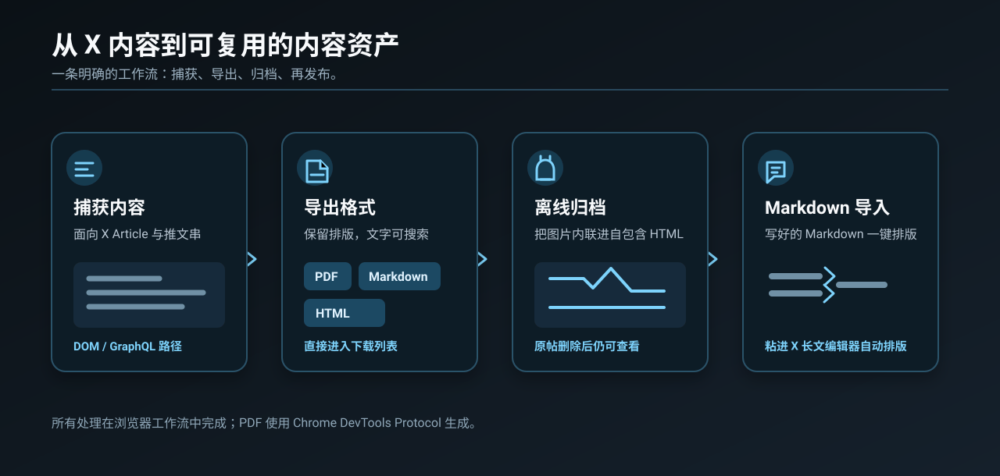
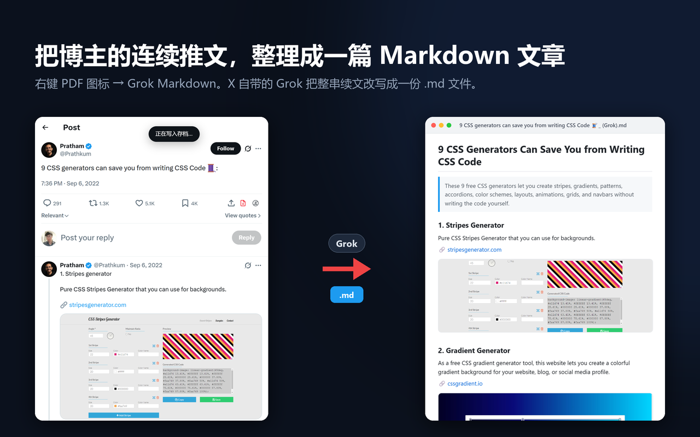

  <a href="README.md">English</a> ·
  <b>简体中文</b> ·
  <a href="README.es.md">Español</a> ·
  <a href="README.pt-BR.md">Português (Brasil)</a>

  

  

  <b><a href="https://chromewebstore.google.com/detail/akmedeebhjkchcpocceffimhpmfjimhn">从 Chrome 网上应用店一键安装</a></b> 
  免费 · 不用克隆、不用打包、不用开开发者模式 · 自动更新 · Edge 也能装

  
  
  

# X Article to PDF：推特长文、推文串一键导出 PDF / Markdown

**X Article to PDF** 是一个免费开源的 Chrome 扩展：把 X（Twitter）的 **Article 长文**和**推文串**
一键存成真正的 PDF——文字可选中、可搜索，图片保持原图分辨率——也能导出 Markdown 和自包含 HTML，
直接进下载列表。不弹打印对话框、不开新标签页、不用注册账号。

它还能用 X 自带的 Grok，把博主在评论区连续写的一长串（技巧 1、技巧 2、技巧 3……）整理成一篇
干净的 Markdown 文章；反过来也能把 Markdown 贴进 X 的长文编辑器，自动排好版。

## 功能

- **推特长文 / 推文串 → PDF**：矢量文字可搜索可复制，图片原图分辨率
- **推文串 → Markdown**：直接导出，或用 **Grok Markdown** 让 AI 改写成一篇结构化文章
- **自包含 HTML**：图片全部内联，原帖被删了也能离线打开
- **本地存档库**：可选，导出过的内容在你自己的设备上留一份
- **Markdown → X 长文编辑器**：贴进 Markdown 草稿，一键转成 X 原生排版
- **隐私**：没有服务器、没有统计，全部在你的浏览器里完成

## 用法

1. 从 **[Chrome 网上应用店](https://chromewebstore.google.com/detail/akmedeebhjkchcpocceffimhpmfjimhn)** 安装（Edge 也可以直接从这里装）
2. 打开任意 X 长文，或者博主在评论区接着写了续文的帖子
3. 点帖子操作栏里的红色 **PDF** 图标（在书签、分享图标旁边）

- **左键** = 导出 PDF（后台生成，落到下载列表）
- **右键** = 格式菜单：PDF / Markdown / HTML（自包含，可离线打开）/ Grok Markdown / 存档库
- 也可以点浏览器工具栏上的扩展图标，效果同左键

> **推文串**：装完扩展后**刷新一次页面**再导出。扩展是从 X 自己的网络响应里读推文串的，
> 当前页面的响应在扩展装好之前就已经到了。读不到时会自动改为从页面上抓，并提示你。

### 用 Grok 把推文串整理成 Markdown 文章

很多博主写长内容不发 Article，而是发一条主帖，再在评论区自己接着回复：技巧 1、技巧 2、技巧 3……
打开这样的帖子，右键红色 PDF 图标，选 **Grok Markdown（AI 整理）**。扩展会在后台标签页里用你自己
已登录的 X 账号，把整串续文交给 x.com 自带的 Grok，让它改写成一篇排版干净的 Markdown 文章：标题、
一句话摘要、每个要点一个小标题，链接和图片都保留。`.md` 文件直接进下载列表，通常一分钟以内，
拖进 Obsidian、Notion 或任何 Markdown 编辑器就能用。

- 只在帖子详情页、且博主在评论区有自己的续文时才出现这一项
- 账号有**专家模式**就用专家模式，没有就用当前可用的模式
- 只把推文串的正文发给 X 自己的 Grok，这段对话会出现在你自己的 Grok 历史里
- 同一菜单里的普通 **Markdown** 是不经过 AI 的直接导出

### 把 Markdown 贴进 X 长文编辑器

进 `x.com/compose/articles/edit/<id>`，**Preview 按钮左边**多一个图标。把 Markdown 原样
贴进正文框，点一下图标：正文就地变成 X 长文自己的排版（标题 / 列表 / 引用 / 粗斜体 / 链接）。
没有确认弹窗，转错了按 **Ctrl+Z**，走的是编辑器自己的编辑历史。

X 长文放不下的东西一律降级，宁可朴素也不丢字：表格 → `甲 | 1` 的普通段落，分隔线 → 一行
`— — —`，图片 → 链接（X 的图必须走它自己的上传）。X 长文没有代码格式，代码块和行内代码都会
落成普通文字。

### 油猴脚本 / 书签小工具

`x-article-exporter.user.js` 拖进 Tampermonkey；或把 `bookmarklet.txt` 全部内容粘进书签网址栏。
这两种形态没有扩展的后台页，所以导出的是自包含 HTML 而不是 PDF；书签小工具的推文串也只能从
页面上抓。

## 常见问题

### 怎么把推特（X）长文导出成 PDF？

装好扩展，在 x.com 上打开那篇 Article，点帖子操作栏里的红色 PDF 图标。PDF 在后台生成，直接存进
下载列表，不弹打印对话框。文字可选中、可搜索，图片保持原图分辨率。

### 推文串怎么保存成 PDF？

打开推文串第一条帖子的详情页（`x.com/<用户>/status/<id>`），装完扩展后先刷新一次页面，再点 PDF
图标。扩展用 X 自己的数据重建整串，时间线滚出视野的帖子也不会丢。

### 推文串怎么转成 Markdown，存进 Obsidian / Notion？

右键 PDF 图标，选 **Markdown** 是直接导出；选 **Grok Markdown** 则由 Grok 改写成带标题、摘要、
小标题的结构化文章。两种都会存成 `.md` 文件，可以直接拖进 Obsidian、Notion、Logseq 等工具。

### 免费吗？会收集我的数据吗？

免费、开源（MIT）。不收集任何数据：没有账号、没有服务器、没有统计、不加载远程代码。唯一会把内容
发出去的是 Grok Markdown，它用你自己的账号把推文串正文发给 X 自己的 Grok。详见
[PRIVACY.md](PRIVACY.md)。

### 为什么 Chrome 会提示「已开始调试此浏览器」？

这是扩展不弹打印框就能生成真 PDF 的办法：用 Chrome 的 `debugger` 接口在后台标签页里把页面渲染成
PDF。运行期间 Chrome 一定会显示这条提示，导出完就消失。调试器挂不上时，会改为下载自包含 HTML。

### Edge 能用吗？

能。Edge 可以直接从 Chrome 网上应用店安装扩展。

## 隐私

**不收集任何数据。** 没有账号、没有服务器、没有统计、没有远程代码。所有导出和归档都在
你自己的浏览器本地完成。各项权限分别用来做什么，详见 [PRIVACY.md](PRIVACY.md)。

## 开发者

内部实现、设计背后踩过的坑，以及怎么从源码加载，见 [docs/DEVELOPMENT.zh-CN.md](docs/DEVELOPMENT.zh-CN.md)。
单元测试：`node test-renderRich.js`。

## 相关项目

「合成 paste 借编辑器自己的上传流水线」这套思路后来拆成了两个独立的零权限扩展：

- [csdn-md-importer](https://github.com/wangsen2020/csdn-md-importer) —— Markdown 一键灌进 CSDN 编辑器，图片自动上传
- [zhihu-md-importer](https://github.com/wangsen2020/zhihu-md-importer) —— Markdown 一键灌进知乎专栏，图片自动上传

## License

MIT
